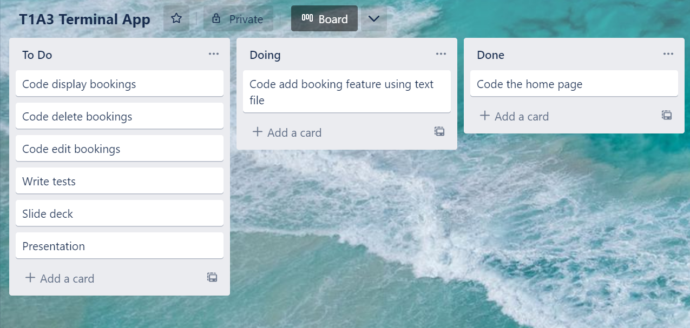
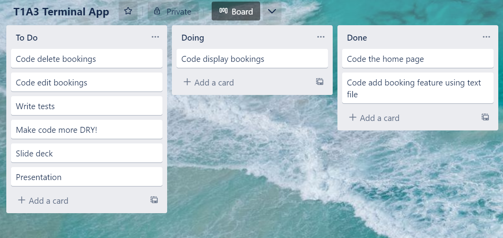
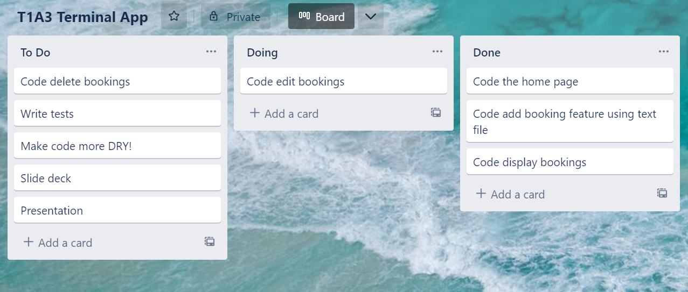
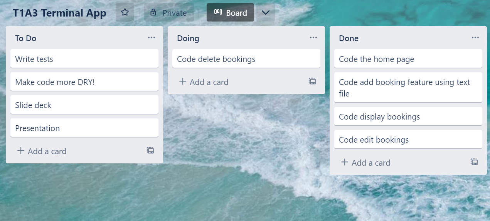
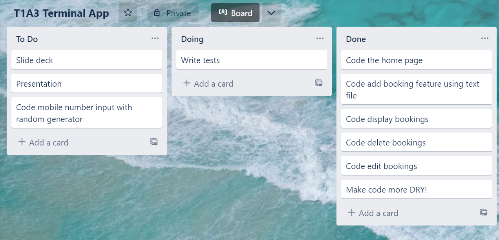
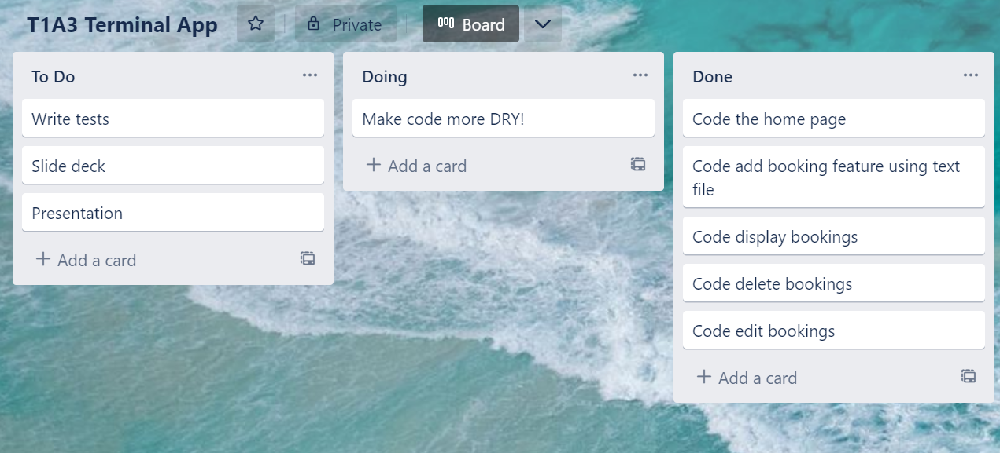

# T1A3 Terminal App

Github - https://github.com/R-Morton/T1A3_terminal_application

Presentation - 

## Restaraunt booking system

The aim of this app is to allow the user from a restaraunt staff member point of view to be able to managage their bookings of the venue for the day.
The following features will be implemented.

### Add booking

The user can navigate from a home page and an option will be to add a booking into the system. This will include the name, time, phone number and amount of people attending (pax). This will get stored into a separate text file, so that they can be viewed if the user closes the app and re runs.

Duration of work - 1 to 2 days

### View bookings

The user will be able to select an option that will display all the bookings for the day.

Duration of work - 1 day

### Search/Edit/Delete bookings

The user will be able to search for a bookings, select from the matches and edit the booking from there.

Duration of work - 2 to 3 days

### Testing

Two functions exist that run the code using pytest to ensure that the code works as intended after any changes get made throughout the development process.

Duration of work - 1 day

### Making the code DRY

I wanted to ensure that my code was as DRY as possible. During the development process, to get my head around many problems, I wrote the code quite in a repetative way. Later on, I looked at what could be DRY
and re wrote the function to be DRY.

Duration of work - 2 days

## Setup/Usage

### Requirments
Git (Windows or Mac)
Python 3

### Using app

From your terminal screen, using 'cd' command, navigate to the directory you downloaded the app to.
App can be located on Github here https://github.com/R-Morton/T1A3_terminal_application

Once your working directory is '/RhysMorton_T1A3', run the line 'start run.sh'.
You should now have your bash window open at the home page of the app.

This application saves bookings to a text file, so that they are saved and still accessable if you close and re open the application. This file is already populated with a number bookings.

To add a booking a booking, from the home page, input '2'. This will then continously prompt for information about the customer which you will need to input.
You will eventually reach the confirmation page, in which you can either confirm or cancel the booking process. If you confirm, the booking will be saved!

To edit a booking, you must first search for the booking. At the home page, input '3'. You will be prompted for a name to input that you wish to search. All matching names will then be displayed in which you then input the number in the list that you wish to select. If there are no matches, you will be taken back to the home page where you can try again.
Once you have selected a matching customer, you will see all the details, and you can confirm wether to edit or go back to home page. 
If you confirm for editing, you will have a selection of details to edit, or you can cancel and return to home.
There is also the option to delete the booking here.
Once atleast one detail has been changed, you will have the option to confirm changes made. Once again a confirmation page with the new details of the customer's booking will appear and you can confirm before the changes get saved.

If you wish to view your bookings for the day, from the home page input '1'. From there you can select a specific service or all of them to view. 
You will be displayed with the relevant bookings, and a total amount of covers (amount of people) for that service.

To exit the program, input '4' from the home page.

